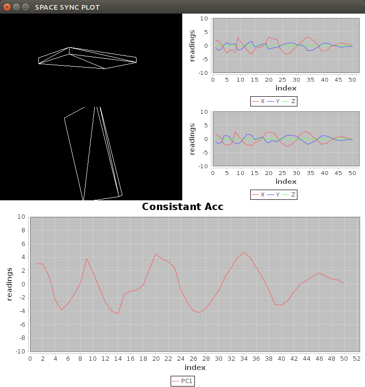

iSpaceSync
===


# 目录
1. [项目简介](#项目简介)
2. [待解决问题](#待解决问题)
3. [项目配置](#项目配置)
4. [使用方式](#使用方式)
5. [主要函数和接口介绍](#主要函数和接口介绍)
6. [传感器数据全局转换](#传感器数据全局转换)
7. [传感器C-S架构传输框架](#传感器c-s架构传输框架)

# 项目简介
该项目的主要目的是在不使用磁力计的情况下，利用一个一致的合力对多个传感器设备进行坐标系的同步。这个项目用于导出一个jar包，供其它应用使用。<br>
##项目包含以下内容：
* 一些用于旋转矩阵运算的工具类
* 一些常用的坐标系转换函数
* 姿态跟踪算法
* 坐标系统一算法
* 传感器客户端与服务处理端的数据通信与传输的框架

# 待解决问题
* 发送接收数据丢包较多
* 手机按y轴竖立起来效果较差
* 算法性能优化
* 平滑处理
* 重连处理

# 项目配置
jar包放在lib文件夹下
* pca_transform-1.0.2.jar
* jama-1.0.2.jar
* spacesyn.jar

...
# 使用方式
demo可以参考[PC端](https://github.com/LeoCai/SpaceSync-PC-Demo)和[Androi端](https://github.com/LeoCai/SpaceSync-Android-Demo)的两个Demo项目
```java
//构造服务端实例
DataServerMultiClient dataServerMultiClient = new DataServerMultiClient();

//等待传感器设备连接完后构造算法与显示
int clientsNum = dataServerMultiClient.getClientsNum();

//传感器姿态追踪回调函数
TrackingCallBack[] trackingCallBacks = new TrackingCallBack[clientsNum];
for (int i = 0; i < clientsNum; i++) {
  PhoneDisplayerPCImpl pcImpl = new PhoneDisplayerPCImpl();
  frameDataListener.addPhoneView(pcImpl.getWorldView().getUniverse().getCanvas());
  trackingCallBacks[i] = new PhoneViewCallBack(pcImpl);
}

//算法中间结果监听
SpaceSyncPCFrameDataListener frameDataListener = new SpaceSyncPCFrameDataListener("SPACE SYNC PLOT",　clientsNum);
//此处获得一个默认的算法模块
SpaceSync spaceSync = SpaceSyncFactory.getDefaultSpaceSync(clientsNum, trackingCallBacks, frameDataListener, frameDataListener);

//向服务器注册算法模块进行监听
Observer spaceSyncOb = new ObserverSpaceSyncMultiClient(clientsNum, spaceSync);
dataServerMultiClient.addDataListener(spaceSyncOb);

//服务器开始监听数据
log("Ready to receive data!");
try {
  dataServerMultiClient.receivedData();
} catch (IOException e1) {
  e1.printStackTrace();
}
```
# 主要函数和接口介绍
[doc](./doc/index.html)
## 接口说明
* 算法主接口 [SpaceSync.java](./src/com/dislab/leocai/spacesync/core/SpaceSync.java)
* 方向估计 [DirectionEstimator.java](./src/com/dislab/leocai/spacesync/core/DirectionEstimator.java)
* 姿态跟踪 [OreintationTracker.java](./src/com/dislab/leocai/spacesync/core/OreintationTracker.java)
* 姿态跟踪 [GyrGaccMatrixTracker.java](./src/com/dislab/leocai/spacesync/transformation/GyrGaccMatrixTracker.java)
* 旋转工具 [RotationUtils.java](./src/com/dislab/leocai/spacesync/utils/RotationUtils.java)

## 数据结构
* 多客户端传感器数据缓冲区[MultiClientDataBuffer.java](./src/com/dislab/leocai/spacesync/core/MultiClientDataBuffer.java)
## 接口实现
* 算法主接口 [SpaceSyncConsistanceImpl.java](./src/com/dislab/leocai/spacesync/core/SpaceSyncConsistanceImpl.java)
* 方向估计 [DirectionEstimatorImpl.java](./src/com/dislab/leocai/spacesync/core/DirectionEstimatorImpl.java)
* 姿态跟踪 [OreintationTrackerImpl.java](./src/com/dislab/leocai/spacesync/core/OreintationTrackerImpl.java)
* 姿态跟踪 [GyrGaccMatrixTracker.java](./src/com/dislab/leocai/spacesync/transformation/GyrGaccMatrixTracker.java)
* 旋转工具 [RotationUtils.java](./src/com/dislab/leocai/spacesync/utils/RotationUtils.java)

# 传感器数据全局转换
## 使用磁力计
```java
double[][] rmt_g2b = RotationUtils.getRotationMatrixG2BBy2Vectors(grivity, magnetic);
double[] global_data = RotationUtils.getGlobalData(localData, rmt_g2b);
```
## 不使用磁力计
姿态跟踪 [GyrGaccMatrixTracker.java](./src/com/dislab/leocai/spacesync/transformation/GyrGaccMatrixTracker.java)

# 传感器C-S架构传输框架
## 接口说明
* 服务端：[DataServer.java](./src/com/dislab/leocai/spacesync/connection/DataServer.java)
* 客户端：[DataClient.java](./src/com/dislab/leocai/spacesync/connection/DataClient.java)

## 使用方式

### 客户端
```java
DataClient dataClient = new DataClientImpl();
try {
    dataClient.connect(address,10007);
} catch (IOException e) {
    e.printStackTrace();
}
dataClient.sendSample(info);
```
### 服务端
```java
//新建服务器实例
DataServerMultiClient dataServerMultiClient = new DataServerMultiClient();
//设置连接监听器
dataServerMultiClient.setOnConnectionListener(new OnConnectedListener() {
			@Override
			public void newClientConnected(String hostAddress) {
				log(hostAddress + "connected");
			}
		});
//启动服务器
dataServerMultiClient.startServer();
Observer spaceSyncOb = new ObserverSpaceSyncMultiClient(clientsNum, spaceSync);
//添加数据接收监听器
dataServerMultiClient.addDataListener(spaceSyncOb);
log("Ready to receive data!");
//开始监听数据
try {
  dataServerMultiClient.receivedData();
} catch (IOException e1) {
  e1.printStackTrace();
}
```
